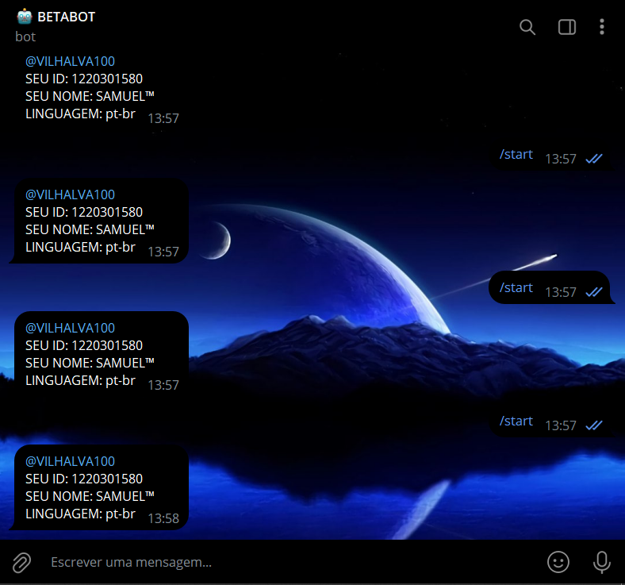

# INFO PRIVADO BOT
🧑‍💻ENCONTRE O SEU ID (E MAIS INFORMAÇÕES) COM ESSE SIMPLES BOT DO TELEGRAM.

 <br>

## AVISO:
Até a data de lançamento deste bot (13/03/2024), o aplicativo oficial do Telegram não oferece uma função nativa que permita aos usuários descobrir o próprio ID. Aqueles que conseguem realizar essa tarefa geralmente utilizam clientes personalizados do Telegram que disponibilizam tal recurso ou contam com a assistência de bots especializados. Foi com o intuito de preencher essa lacuna que desenvolvi a minha própria versão simplificada desse recurso. Mesmo que o Telegram venha a incorporar essa funcionalidade em futuras atualizações, manterei este bot ativo aqui no [GITHUB](https://github.com/VILHALVA?tab=repositories&q=+topic:BOT) como uma alternativa prática e acessível.

## DESCRIÇÃO:
Este é um bot do Telegram que responde ao comando "/start" fornecendo informações sobre o usuário que iniciou a conversa. Aqui está uma explicação das informações que ele fornece:

1. **Username (@)**: Se o usuário tiver um nome de usuário configurado em sua conta do Telegram, o bot incluirá este username na mensagem de resposta, precedido pelo símbolo "@".

2. **ID**: O ID do usuário é uma identificação única atribuída a cada usuário pelo Telegram. Ele é usado para distinguir os usuários de maneira única e é útil para identificar e rastrear usuários em bots e outras interações.

3. **Nome (First Name)**: O bot incluirá o primeiro nome do usuário na mensagem de resposta. Esse é o nome pelo qual o usuário é conhecido no Telegram.

4. **Sobrenome (Last Name)**: Se o usuário tiver um sobrenome associado à sua conta do Telegram, o bot incluirá esse sobrenome na mensagem de resposta. No entanto, nem todos os usuários têm um sobrenome configurado em suas contas.

5. **Linguagem (Language)**: O bot também pode incluir o código de idioma preferido do usuário, se estiver disponível. Isso pode ser útil para adaptar as respostas do bot ao idioma preferido do usuário.

## EXECUTANDO O PROJETO:
1. **Coloque o Token:**
   - Antes de executar o programa, é necessário substituir o token do seu bot no arquivo `TOKEN.py`, o qual pode ser obtido por meio do [@BotFather](https://t.me/BotFather). Certifique-se também de que todas as dependências estejam instaladas em sua máquina. Se você não estiver familiarizado com esses passos, confira nosso [curso completo sobre a criação de bots no Telegram](https://github.com/VILHALVA/CURSO-DE-TELEGRAM-BOT) para obter orientações detalhadas.

2. **Inicie o Bot:**
   - Execute o bot do Telegram em Python iniciando-o com o seguinte comando:
```bash
   python MAIN.py
```
   - Inicie o bot enviando o comando `/start`. Receba uma mensagem de informação.

## SAIBA MAIS:
- [PROJETO CRIADO PELO VILHALVA](https://github.com/VILHALVA)
- [ESSE PROJETO FOI INSPIRADO NO INFOBOT EM JAVA](https://github.com/nadam/userinfobot)
- [ESSE PROJETO FOI INSPIRADO NO BUSCADOR DE ID](https://github.com/VILHALVA/BUSCADOR-DE-ID)
- [FAÇA OS NOSSOS CURSOS](https://github.com/VILHALVA?tab=repositories&q=+topic:CURSO)

